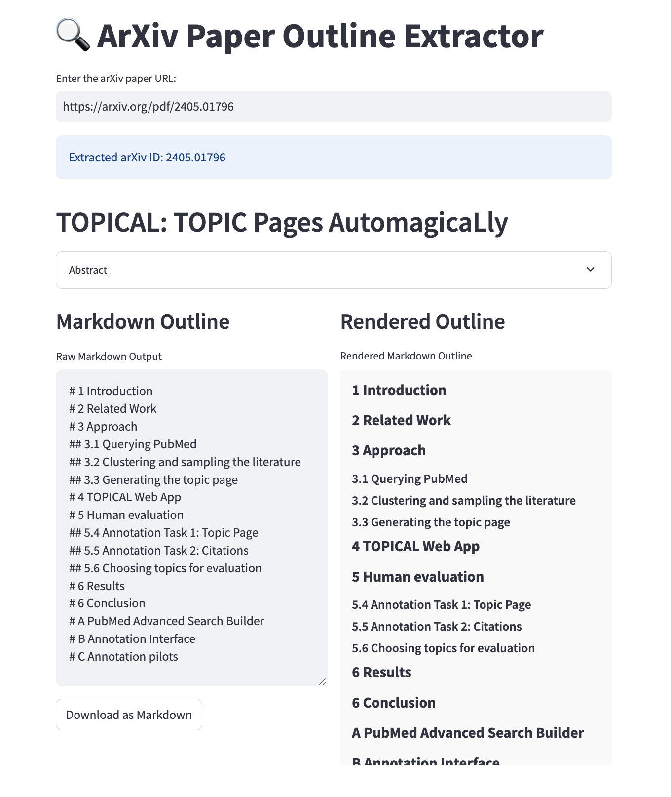

# arxiv-outline-extractor

A lightweight Streamlit application that extracts and displays key sections from arXiv papers, including the title, abstract, and section headings. By leveraging the arXiv API and PDF parsing tools, this tool simplifies navigating academic research.



## Features

- **Metadata Extraction:** Retrieve the title and abstract of an arXiv paper.
- **PDF Download & Parsing:** Download the paper's PDF and extract its table of contents (if available).
- **Interactive UI:** Use Streamlit to quickly input an arXiv URL and view the results.


## Installation

1. **Clone the Repository:**

   ```bash
   git clone https://github.com/danilotpnta/arxiv-outline-extractor.git
   cd arxiv-outline-extractor
   ```

2. **Create a Virtual Environment:**

   ```bash
   conda create -n arxiv-toc python=3.11 -y
   conda activate arxiv-toc
   ```

3. **Install Dependencies:**

   ```bash
   pip install -r requirements.txt
   ```

## Running the App

Start the Streamlit application with the following command:

```bash
python -m streamlit run app.py
```

Then open the provided URL in your browser and enter an arXiv paper URL to view its outline.

## Contributing

Contributions are welcome! If you encounter any issues or have ideas for improvements, please open an issue or submit a pull request.

## License

This project is licensed under the [MIT License](LICENSE).
